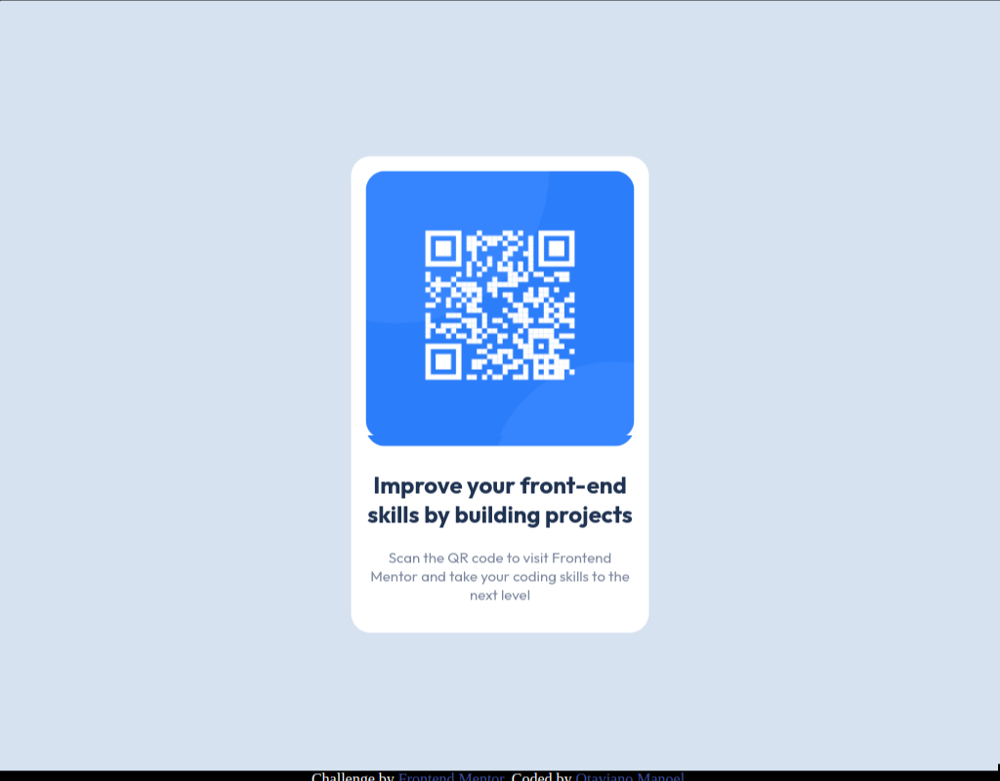

# Frontend Mentor - QR code component solution

This is a solution to the [QR code component challenge on Frontend Mentor](https://www.frontendmentor.io/challenges/qr-code-component-iux_sIO_H). Frontend Mentor challenges help you improve your coding skills by building realistic projects. 

## Table of contents

- [Overview](#overview)
  - [Screenshot](#screenshot)
  - [Links](#links)
- [My process](#my-process)
  - [Built with](#built-with)
  - [What I learned](#what-i-learned)
  - [Continued development](#continued-development)
  - [Useful resources](#useful-resources)
- [Author](#author)

## Overview

### Screenshot




### Links

**Trocar os links
- Solution URL: [Add solution URL here](https://your-solution-url.com)
- Live Site URL: [Add live site URL here](https://otaviano-manoel.github.io/qr-code-component-main/)

## My process

### Built with

- Semantic HTML5 markup
- CSS custom properties
- Mobile-first workflow

### What I learned

I would like to highlight the way I center the panel where the QR code is using the position: absolute property, which I didn't know how to use very well.

```css
main {
    position: absolute;
    top: 50%;
    left: 50%;
    transform: translate(-50%, -50%);
}
```

I learned it through DevQuest, and I really liked the outcome.

### Continued development

I will continue to work on HTML and CSS projects to improve myself. In the future, I plan to implement JavaScript in my projects.

### Useful resources

- [responsive-viewer](https://github.com/skmail/responsive-viewer) - This helped me because it displays various screen resolutions, which is very helpful for page responsiveness. I really liked this extension and plan to use it in my future projects.

## Author

- Frontend Mentor - [@Otaviano-Manoel](https://www.frontendmentor.io/profile/Otaviano-Manoel)
